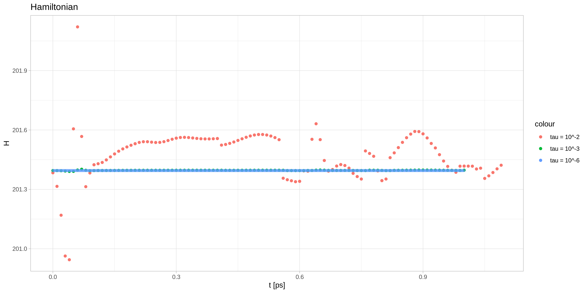

### Badanie stabilności równania (5.1)

1. Wykresy `E_mean` od `tau` (`tau`  od 10e-6 do 10e-2 ps)
2. Wykresy niestabilne `H, V, P, T` od `t` i dla stabilnego
3. 5.2 E(a) a od 0 do 1??, aby energia potencjalna była najmniejsza
4. 5.3 find `T0` using visualization (save gif of correct T0 using https://ezgif.com/apng-maker)

To convert images into gif :smile:
```bash
ffmpeg -framerate 60  -i animation%d.png  out.gif
```

- Stability testing


- Compare different tau




- Simulation for 5.3 `T0 = 90K`


